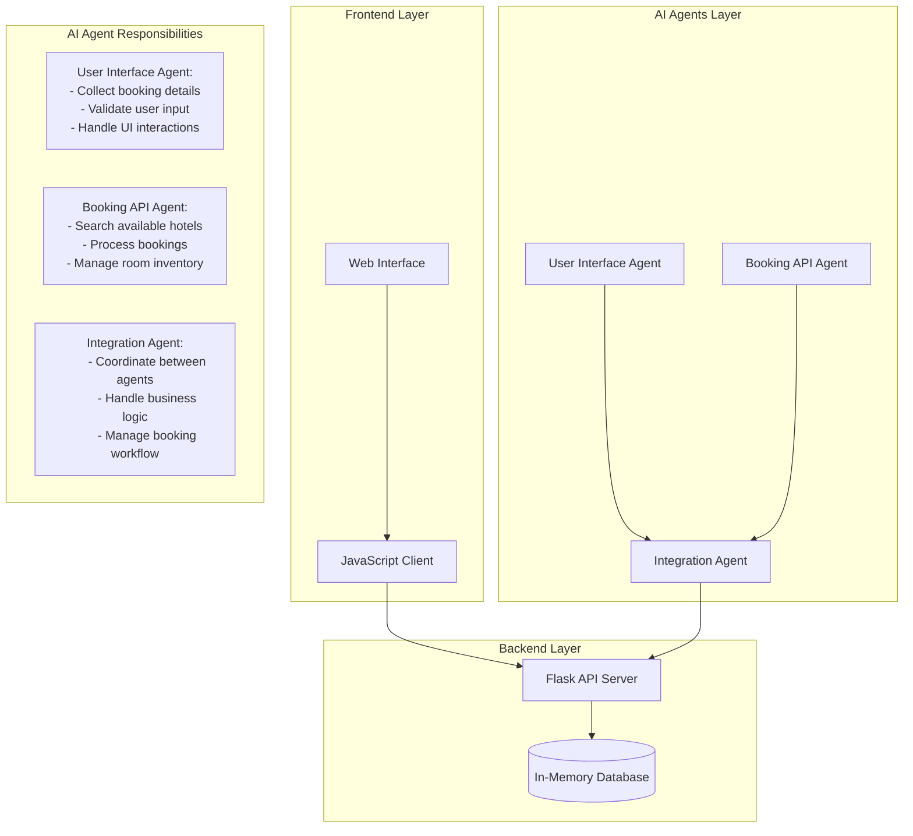
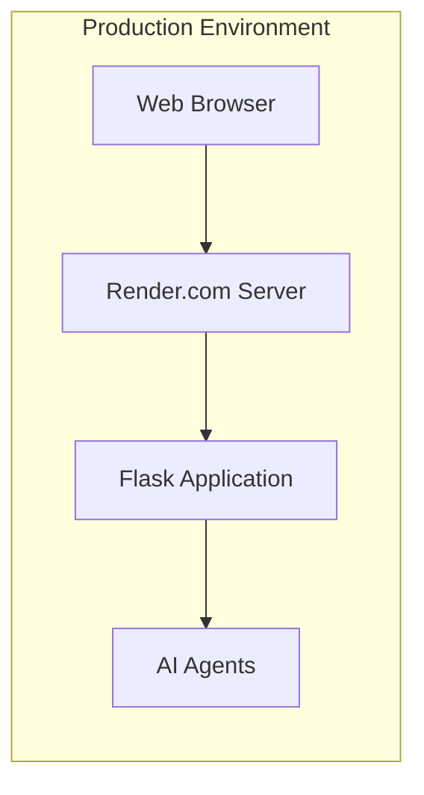

# Hotel Booking System Architecture

## System Overview

The Hotel Booking System is a modern web application built with a microservices-inspired architecture, incorporating AI agents for enhanced functionality. The system combines traditional web technologies with intelligent agents to provide a seamless booking experience.

## Architecture Diagram



## Component Details

### 1. Frontend Layer
- **Web Interface**: Built with HTML5, Bootstrap 5, and modern CSS
- **JavaScript Client**: Handles dynamic content and API interactions
- **Features**:
  - Real-time hotel search
  - Dynamic filtering
  - Interactive booking modal
  - Date selection with validation
  - Responsive design

### 2. Backend Layer
- **Flask API Server**: RESTful API endpoints
- **In-Memory Database**: Stores hotel and booking data
- **Key Endpoints**:
  - `/api/hotels`: Hotel search and filtering
  - `/api/book`: Booking processing
  - `/api/bookings/<id>`: Booking retrieval

### 3. AI Agents Layer

#### User Interface Agent
- **Purpose**: Manages user interactions and data collection
- **Capabilities**:
  ```python
  class UserInterfaceAgent:
      def collect_destination(self)
      def collect_dates(self)
      def collect_guests_info(self)
      def collect_preferences(self)
      def validate_input(self)
  ```

#### Booking API Agent
- **Purpose**: Handles hotel search and booking logic
- **Capabilities**:
  ```python
  class BookingAPIAgent:
      def search_hotels(self, criteria)
      def check_availability(self, hotel_id, dates)
      def process_booking(self, booking_details)
      def update_inventory(self, hotel_id)
  ```

#### Integration Agent
- **Purpose**: Orchestrates communication between agents
- **Capabilities**:
  ```python
  class IntegrationAgent:
      def __init__(self)
      def coordinate_booking_flow(self)
      def handle_errors(self)
      def manage_state(self)
  ```

## AI Agent Interaction Flow

1. **Initial User Interaction**
   ```mermaid
   sequenceDiagram
       User->>UI_Agent: Input booking criteria
       UI_Agent->>Integration_Agent: Validate & format input
       Integration_Agent->>Booking_Agent: Request hotel search
       Booking_Agent->>Integration_Agent: Return matching hotels
       Integration_Agent->>UI_Agent: Format results
       UI_Agent->>User: Display results
   ```

2. **Booking Process**
   ```mermaid
   sequenceDiagram
       User->>UI_Agent: Select hotel & dates
       UI_Agent->>Integration_Agent: Validate selection
       Integration_Agent->>Booking_Agent: Check availability
       Booking_Agent->>Integration_Agent: Confirm availability
       Integration_Agent->>UI_Agent: Process booking
       UI_Agent->>User: Confirm booking
   ```

## Technical Implementation

### Agent Communication
```python
# Example of agent communication
class IntegrationAgent:
    def process_booking_request(self, user_input):
        # UI Agent validates input
        validated_data = self.ui_agent.validate_input(user_input)
        
        # Booking Agent processes request
        booking_result = self.booking_agent.process_booking(validated_data)
        
        # Integration Agent manages response
        return self.format_response(booking_result)
```

### Error Handling
```python
# Example of error handling across agents
def handle_booking_error(self, error):
    if isinstance(error, ValidationError):
        return self.ui_agent.show_error_message(error)
    elif isinstance(error, BookingError):
        return self.booking_agent.handle_booking_failure(error)
    else:
        return self.integration_agent.handle_system_error(error)
```

## Deployment Architecture



## Future Enhancements

1. **AI Agent Improvements**
   - Machine learning for price optimization
   - Natural language processing for user queries
   - Predictive analytics for availability

2. **System Enhancements**
   - Persistent database integration
   - User authentication
   - Payment processing
   - Email notifications 